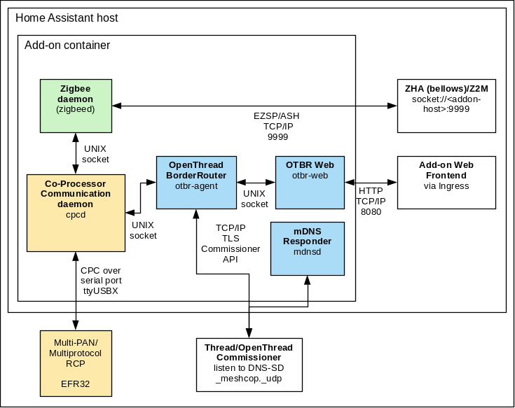

# Home Assistant Add-on: Silicon Labs Multiprotocol

## Installation

Follow these steps to get the add-on installed on your system:

1. Navigate in your Home Assistant frontend to **Settings** -> **Add-ons, Backup & Supervisor** -> **Add-on Store**.
2. Find the "Silicon Labs Multiprotocol" add-on and click it.
3. Click on the "INSTALL" button.

## How to use

The add-on needs a Silicon Labs based wireless module accessible through a
serial port (like the module on Yellow or most USB based wireless adapters).

**NOTE:** The Silicon Labs Multiprotocol add-on needs the RCP Multi-PAN firmware
loaded on the Silicon Labs wireless controller. For Yellow, you can find this
firmware at [github.com/NabuCasa/silabs-firmware](https://github.com/NabuCasa/silabs-firmware).

Once the firmware is loaded follow the following steps:

1. Select the correct `device` in the add-on configuration tab and press `Save`.
2. Start the add-on.

**NOTE:** the Web frontend is only accessible when OpenThread is enabled (see below).

### Zigbee

To use Zigbee with ZHA configure the Integration as follows:

1. Remember/copy the hostname of the add-on (e.g. `c8f00288-silabs-multiprotocol`).
2. Add the Zigbee Home Automation (ZHA) integration to Home Assitant Core
3. When asked for the Serial Device Path, choose `Enter Manually`.
4. Choose `EZSP` as Radio type.
5. As serial path, enter `socket://<hostname-from-above>:9999`.
6. Port speed and flow control don't matter.
7. Press `Submit`. Adding ZHA should succeed and you should be able to use ZHA
   as if using any other supported radio type.

### OpenThread

At this point OpenThread support is experimental. This add-on makes your Home
Assistant installation an OpenThread BorderRouter (OTBR). There is no integration
in Home Assistant Core at this point.

To use the OTBR enable it in the Configuration tab and restart the add-on. With
that you will be able to access the OTBR web frontend. When joining or forming a
network make sure to use the same IEEE 802.15.4 channel for both OpenThread and
Zigbee, and *different* PAN IDs. This limitations stem from the fact that a single
radio is used.

Follow the guides at [openthread.io](https://openthread.io), e.g. the [OpenThread
Commissioner](https://openthread.io/guides/commissioner) guide.

## Configuration

Add-on configuration:

| Configuration      | Description                                            |
|--------------------|--------------------------------------------------------|
| device (mandatory) | Serial sevice where the Silicon Labs radio is attached |
| baudrate           | Serial port baudrate (depends on firmware)   |
| flow_control       | If hardware flow control should be enabled (depends on firmware) |
| cpcd_trace         | Co-Processsor Communication tracing (trace in log)     |
| socat_trace        | ASH/EZSP communication trace (trace in log)            |
| otbr_enable        | Enable OpenThread BorderRouter                         |
| otbr_debug         | Start OpenThread BorderRouter Agent with debug log     |

## Known issues and limitations

- No aarch64 support at this time
- Some devices seem to fail to join the network

## Architecture

The add-on runs several service internally. This architecture diagram shows what
the add-on currently implements.

## Support

Got questions?

You have several options to get them answered:

- The [Home Assistant Discord Chat Server][discord].
- The Home Assistant [Community Forum][forum].
- Join the [Reddit subreddit][reddit] in [/r/homeassistant][reddit]

In case you've found a bug, please [open an issue on our GitHub][issue].

[discord]: https://discord.gg/c5DvZ4e
[forum]: https://community.home-assistant.io
[reddit]: https://reddit.com/r/homeassistant
[issue]: https://github.com/home-assistant/addons/issues
